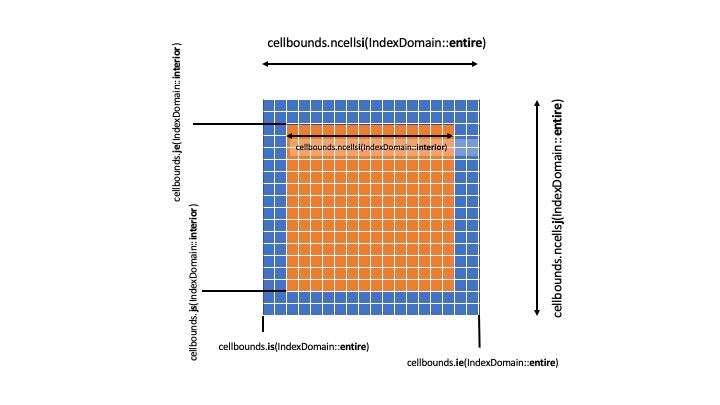

# Domain

# IndexShape Class

The index shape class provides access to the index bounds of a mesh block. The
bounds are split into two domains which can be accessed using a class enum
**IndexDomain**. The **IndexDomain** can be:
- **entire,** which allows one to access the starting indices of the
full meshblock including ghost zones
- **interior,** which allows access to the interior of the meshblock
excluding ghost cells
- **inner_x1,** which accesses the ghost zones for "inner" face of
  a meshblock in the `x1` direction
- **outer_x1,** which accesses the ghost zones for "outer" face of
  a meshblock in the `x1` direction
- **inner_x2,** which accesses the ghost zones for "inner" face of
  a meshblock in the `x2` direction
- **outer_x2,** which accesses the ghost zones for "outer"` face of
  a meshblock in the `x2` direction
- **inner_x3,** which accesses the ghost zones for "inner" face of
  a meshblock in the `x3` direction
- **outer_x3,** which accesses the ghost zones for "outer"` face of
  a meshblock in the `x3` direction

The starting and ending indices of each dimension of the index shape can be
accessed using the **is**, **ie**, **js**, **je**, **ks**, **ke** methods.
Currently, access is limited to three dimensions, if needed it can be extended.
In cases where the indices are called often it may be more conveneint to pull
out the index bounds of a given domain. The **IndexRange** struct provides an
easy way to group the indices together. 

The **IndexShape** class also provides a means for accessing the number of
cells in each dimension of each of the domains. This is provided with the
**ncellsi**, **ncellsj**, and **ncellsk** methods. 

Below is a diagram illustrating a 2d instance of an IndexShape which we will
call cellbounds.



# IndexRange Struct

The index range struct simply contains the starting and ending indices as well
as a method for returning the total number of cells within the range. 

## Example Usage

The primary use case of the **IndexShape** occurs when indexing over the
different dimensions. Assuming we have a meshblock pointer given as **pmb** e.g.

```
  const IndexRange ib = pmb->cellbounds.GetBoundsI(IndexDomain::interior); 
  const IndexRange jb = pmb->cellbounds.GetBoundsJ(IndexDomain::interior); 
  const IndexRange kb = pmb->cellbounds.GetBoundsK(IndexDomain::interior); 

  for( int k = kb.s; k <= kb.e; k++ ){
    for( int j = jb.s; j <= jb.e; j++ ){
      for( int i = ib.s; i <= ib.e; i++ ){
        ... code ..
      }
    }
  }

```
